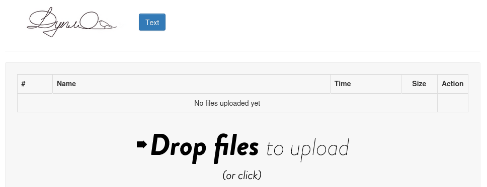

# Duplo

Web application for anonymous file sharing. Alternative backend for [Mikhalevich/filesharing](https://github.com/Mikhalevich/filesharing).



# Features

* Uploading files to server from browser, including by drag and drop.
* Easy way to publish a text snippet (pastebin-style).
* Uploaded html pages immediately become viewable in browser.
* Automatic cleanup of old files in one of the two directories.
* Quotas to prevent excessive files count or total byte size.
* Easy deployment: executable embeds static assets, is usable as is (without a separate Web server).
* Supports HTTP/2.
* Logging that inclues uploads, removes and cleanups.

# Limitations

* No authentication (unlike in original "filesharing" project).
* No overload protection (besides disk quotas) - DoS of the host that has Duplo deployed may be possible.
* Iffy web security. Uploaded html files are served as `text/html`, which affects web security of the origin Duplo is deployed at.
* Configuration is not very flexible. Unlike original "filesharing" there always two shares. You may want to override "Content-Security-Policy" header for served content for more permissive or more restrictive rules.
* Not tested on non-Linux

Deploying globally accessible instances of Duplo is not recommended.

# Deployment

1. Download pre-built release of Duplo from [Github Releases](https://github.com/vi/duplo/releases) or build it from the source code with `cargo install --path .'
2. Choose two directories: transient (old files are clean up daily) and permanent (no cleanup happens).
3. Choose port to serve incomding requests on.
4. Start the application: `duplo 0.0.0.0:80 -t /path/to/directory_where_old_files_disappear -p /path/to/permanent_directory`
5. Navigate to `http://127.0.0.1:80/` - redirect would take you to the transient fileshare. There is no link to permanent fileshare anywhere - you need to access it by explicit URL: `http://127.0.0.1:80/permanent/`. Test that some upload or text share work.

It should not be tricky to deploy it as a SystemD service or in Docker.

Default quotas as 10GB and 1000 files. By default, cleanup happens at 00:00 GMT+0 and removes files older than 24 hours.

There is no option to opt out of one of the two fileshares - you can specify empty directory without write access to workaround this.

# Usage message

<details><summary>`duplo --help` output</summary>

```
Usage: duplo <listen_socket> -t <transiet-directory> -p <permanent-directory> [--max-files <max-files>] [--max-bytes <max-bytes>] [--cleanup-time-utc <cleanup-time-utc>] [--cleanup-maxhours <cleanup-maxhours>] [--transient-title <transient-title>] [--permanent-title <permanent-title>] [--content-security-policy <content-security-policy>]

simple insecure HTTP server with anonymous file upload (including html/js upload and publication)

Positional Arguments:
  listen_socket     socket address to bind TCP socket and listen for including
                    HTTP requests

Options:
  -t, --transiet-directory
                    serve (and upload) files from this directory at /transient/
  -p, --permanent-directory
                    serve (and upload) files from this directory at /permanent/
  --max-files       maximum number of files allowed to reside in transient and
                    permanent directories. Default is 1000
  --max-bytes       maximum number of bytes allowed to reside in transient and
                    permanent directories. Default is 10GB
  --cleanup-time-utc
                    time of day (UTC+0 timezone) to trigger the cleanup event
                    on. Default is `00:00:00`
  --cleanup-maxhours
                    clean up files older than this number of hours from the
                    transient directory. Default is 24.
  --transient-title page title for transient directory's filelist
  --permanent-title page title for permanent directory's filelist
  --content-security-policy
                    set this Content-Security-Policy header for served files
  --help            display usage information

```

</details>

# License

Code in `src/` directory is original and is licensed with MIT or Apache-2.0.  
Code within `res/` directory (e.g. jquery, dropzone.js, bootstrap) originates from multiple sources and typically have MIT-like licenses. Those files are embedded into executalbe at build time.  
Code in `templates/` is based on [filesharing-web-service](https://github.com/Mikhalevich/filesharing-web-service/tree/22e686e89aee40447e0a0942c444170806bd3cfb), which does not specify a licence.  
